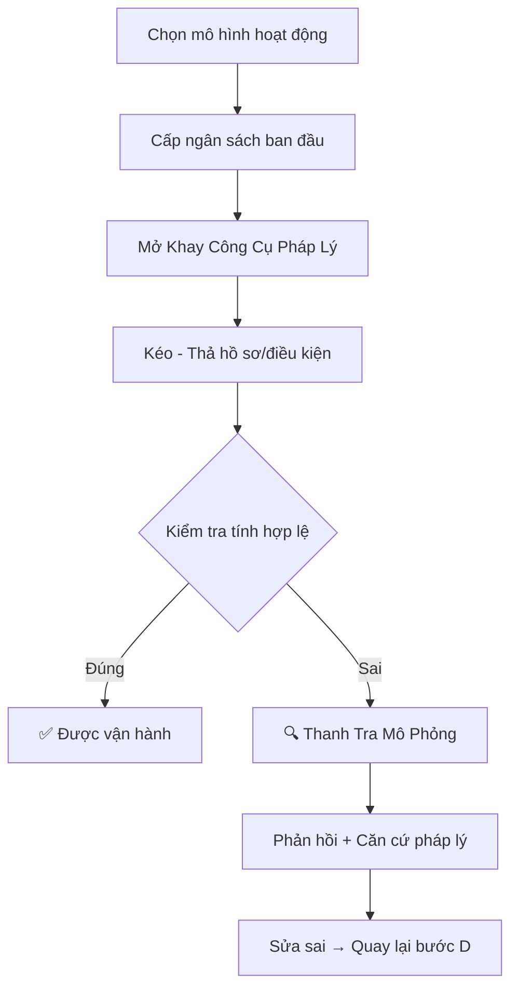
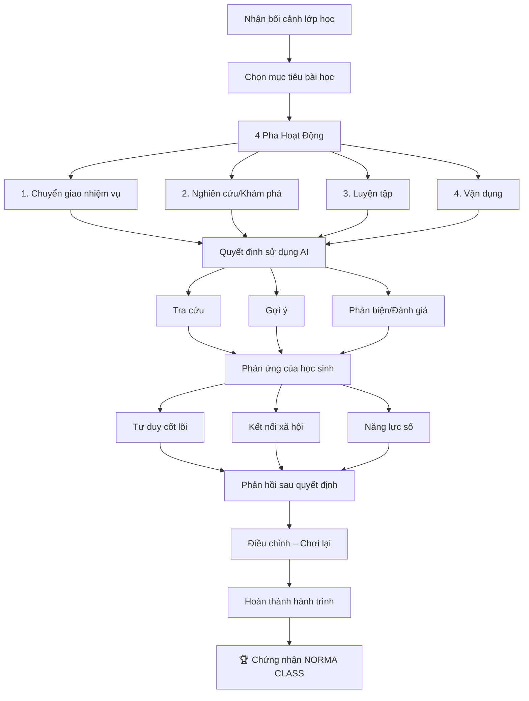

# 🎮 NORMA CLASS — TÀI LIỆU THIẾT KẾ & KẾ HOẠCH PHÁT TRIỂN

> **Phiên bản:** 1.0  
> **Ngày tạo:** 01/10/2026  
> **Loại:** Trò chơi mô phỏng giáo dục  
> **Nền tảng:** Web App (Vite + React + TypeScript)  
> **AI:** Giả lập bằng kịch bản có sẵn (không cần API)  
> **Giao diện:** Thiết kế trên Figma riêng

---

## MỤC LỤC

1. [Tổng quan trò chơi](#i-tổng-quan-trò-chơi)
2. [Chế độ 1: Khởi Nghiệp Giáo Dục](#ii-chế-độ-1-khởi-nghiệp-giáo-dục)
3. [Chế độ 2: Mô Phỏng Lớp Học](#iii-chế-độ-2-mô-phỏng-lớp-học)
4. [Hệ thống chứng nhận](#iv-hệ-thống-chứng-nhận)
5. [Kiến trúc kỹ thuật](#v-kiến-trúc-kỹ-thuật)
6. [Hệ thống dữ liệu giả lập AI](#vi-hệ-thống-dữ-liệu-giả-lập-ai)
7. [Kế hoạch phát triển](#vii-kế-hoạch-phát-triển)
8. [Bảng tổng hợp dữ liệu kịch bản](#viii-bảng-tổng-hợp-dữ-liệu-kịch-bản)

---

## I. TỔNG QUAN TRÒ CHƠI

### 1.1 Mô tả ngắn

**NORMA CLASS** là trò chơi mô phỏng giáo dục, cho phép người chơi trải nghiệm 2 khía cạnh của ngành giáo dục:
- **Khởi nghiệp** — Thành lập cơ sở giáo dục đúng pháp luật
- **Giảng dạy** — Tổ chức bài dạy trong lớp học thực tế

### 1.2 Đối tượng người chơi

- Sinh viên sư phạm
- Giáo viên mới vào nghề
- Người quan tâm đến khởi nghiệp giáo dục

### 1.3 Bảng tổng quan 2 chế độ

| Chế độ | Tên gọi | Vai trò người chơi | Mục tiêu |
|:---:|:---|:---|:---|
| **1** | Khởi Nghiệp Giáo Dục | Nhà sáng lập trung tâm/trường học | Xây dựng cơ sở giáo dục hợp pháp, vượt qua thanh tra |
| **2** | Mô Phỏng Lớp Học | Giáo viên đứng lớp | Thiết kế & dạy bài học, quản lý phản ứng học sinh |

### 1.4 Mục tiêu giáo dục

| Chế độ | Người chơi sẽ hiểu được |
|:---|:---|
| Chế độ 1 | Quy trình pháp lý khi mở cơ sở giáo dục, các loại hồ sơ cần thiết, hậu quả khi thiếu giấy tờ |
| Chế độ 2 | Cách thiết kế bài dạy theo 4 pha, khi nào nên/không nên dùng AI, cân bằng năng lực học sinh |

### 1.5 Cấu trúc tổng thể

```
NORMA CLASS
├── Trang chủ → Chọn chế độ chơi
├── Chế độ 1: Khởi Nghiệp Giáo Dục (6 bước)
├── Chế độ 2: Mô Phỏng Lớp Học (8 bước)
└── Chứng nhận NORMA CLASS
```

---

## II. CHẾ ĐỘ 1: KHỞI NGHIỆP GIÁO DỤC

### 2.1 Tóm tắt luồng chơi



```
Bước 1: Chọn mô hình hoạt động
    ↓
Bước 2: Nhận ngân sách ban đầu
    ↓
Bước 3: Mở Khay Công Cụ Pháp Lý
    ↓
Bước 4: Kéo – Thả hồ sơ/điều kiện vào bộ hồ sơ
    ↓
Bước 5: Kiểm tra tính hợp lệ
    ├── ĐÚNG → Được vận hành → Kết thúc thành công
    └── SAI → Thanh Tra Mô Phỏng → Phản hồi + Căn cứ pháp lý → Sửa sai → Quay lại Bước 4
```

---

### 2.2 Bước 1 — Chọn mô hình hoạt động

Người chơi chọn **1 trong 4 mô hình** giáo dục để khởi nghiệp. Mỗi mô hình có bộ yêu cầu pháp lý khác nhau.

| ID | Mô hình | Mô tả ngắn | Độ khó |
|:---:|:---|:---|:---:|
| M1 | **Trung tâm ngoại ngữ** | Dạy tiếng Anh, tiếng Hàn, tiếng Nhật... cho người lớn & trẻ em | ⭐⭐ |
| M2 | **Trung tâm kỹ năng sống** | Dạy kỹ năng mềm, giao tiếp, lãnh đạo cho học sinh phổ thông | ⭐⭐ |
| M3 | **Trường mầm non tư thục** | Chăm sóc & giáo dục trẻ 3-6 tuổi, hoạt động cả ngày | ⭐⭐⭐ |
| M4 | **Trung tâm STEM / Tin học** | Dạy lập trình, robotics, khoa học ứng dụng cho trẻ em | ⭐⭐ |

**Thông tin hiển thị khi chọn:**
- Tên mô hình
- Mô tả ngắn (2-3 dòng)
- Độ khó (số sao)
- Số lượng hồ sơ cần hoàn thành

---

### 2.3 Bước 2 — Nhận ngân sách ban đầu

Sau khi chọn mô hình, người chơi nhận **ngân sách khởi điểm** cố định.

| Mô hình | Ngân sách ban đầu | Ghi chú |
|:---|:---:|:---|
| Trung tâm ngoại ngữ | 200.000.000 VNĐ | Chi phí trung bình |
| Trung tâm kỹ năng sống | 150.000.000 VNĐ | Chi phí thấp hơn |
| Trường mầm non tư thục | 500.000.000 VNĐ | Cần cơ sở vật chất nhiều |
| Trung tâm STEM / Tin học | 300.000.000 VNĐ | Cần thiết bị đắt tiền |

**Cơ chế ngân sách:**
- Mỗi hồ sơ/điều kiện khi kéo vào bộ hồ sơ sẽ **trừ chi phí** tương ứng
- Nếu hết ngân sách → không thể thêm hồ sơ → phải bỏ bớt hồ sơ không cần thiết
- Mục tiêu: chọn đúng hồ sơ cần thiết mà **không vượt ngân sách**

---

### 2.4 Bước 3 & 4 — Khay Công Cụ Pháp Lý + Kéo Thả

#### 2.4.1 Danh sách toàn bộ hồ sơ trong Khay

Khay chứa **tất cả** các loại hồ sơ/điều kiện. Người chơi phải **chọn đúng** những hồ sơ cần thiết cho mô hình đã chọn.

| ID | Hồ sơ / Điều kiện | Chi phí | Loại |
|:---:|:---|:---:|:---:|
| D01 | Đơn đăng ký thành lập | 500.000 | Giấy tờ |
| D02 | Giấy chứng nhận đăng ký kinh doanh | 2.000.000 | Giấy tờ |
| D03 | Đề án hoạt động giáo dục | 5.000.000 | Giấy tờ |
| D04 | Chương trình đào tạo chi tiết | 3.000.000 | Giấy tờ |
| D05 | Giấy phép hoạt động giáo dục (Sở GD&ĐT) | 10.000.000 | Giấy phép |
| D06 | Hồ sơ phòng cháy chữa cháy (PCCC) | 15.000.000 | An toàn |
| D07 | Giấy chứng nhận vệ sinh an toàn thực phẩm | 8.000.000 | An toàn |
| D08 | Hợp đồng thuê mặt bằng (≥ 5 năm) | 50.000.000 | Cơ sở |
| D09 | Bản vẽ thiết kế cơ sở vật chất | 10.000.000 | Cơ sở |
| D10 | Bằng cấp sư phạm của giáo viên | 3.000.000 | Nhân sự |
| D11 | Hợp đồng lao động giáo viên | 5.000.000 | Nhân sự |
| D12 | Lý lịch tư pháp người đứng đầu | 500.000 | Giấy tờ |
| D13 | Giấy khám sức khỏe nhân viên | 2.000.000 | Nhân sự |
| D14 | Nội quy hoạt động cơ sở | 1.000.000 | Giấy tờ |
| D15 | Bảng giá công khai dịch vụ | 500.000 | Giấy tờ |
| D16 | Hồ sơ bảo hiểm cho học viên | 10.000.000 | An toàn |
| D17 | Chứng chỉ ngoại ngữ quốc tế của GV (IELTS/TOEFL) | 5.000.000 | Chuyên môn |
| D18 | Thiết bị dạy học chuyên dụng (máy tính, robot...) | 80.000.000 | Thiết bị |
| D19 | Giấy phép nuôi dạy trẻ (Sở LĐ-TB&XH) | 10.000.000 | Giấy phép |
| D20 | Nhân viên y tế / phòng y tế | 15.000.000 | Nhân sự |
| D21 | Khu vui chơi ngoài trời đạt chuẩn | 30.000.000 | Cơ sở |
| D22 | Bếp ăn bán trú đạt chuẩn | 40.000.000 | Cơ sở |
| D23 | Giấy phép kinh doanh dịch vụ tư vấn | 5.000.000 | Giấy phép |

> **Lưu ý:** Không phải tất cả hồ sơ đều cần cho mọi mô hình. Có những hồ sơ là **bẫy** — nếu chọn sẽ tốn ngân sách mà không cần thiết.

#### 2.4.2 Bảng yêu cầu hồ sơ cho từng mô hình

Bảng bên dưới liệt kê hồ sơ **bắt buộc** (✅) và **không cần** (—) cho mỗi mô hình. Hồ sơ không bắt buộc nếu chọn sẽ **trừ ngân sách** nhưng **không tính sai**.

| ID | Hồ sơ | M1 Ngoại ngữ | M2 Kỹ năng sống | M3 Mầm non | M4 STEM |
|:---:|:---|:---:|:---:|:---:|:---:|
| D01 | Đơn đăng ký thành lập | ✅ | ✅ | ✅ | ✅ |
| D02 | Đăng ký kinh doanh | ✅ | ✅ | ✅ | ✅ |
| D03 | Đề án hoạt động giáo dục | ✅ | ✅ | ✅ | ✅ |
| D04 | Chương trình đào tạo | ✅ | ✅ | ✅ | ✅ |
| D05 | Giấy phép hoạt động GD | ✅ | ✅ | ✅ | ✅ |
| D06 | PCCC | ✅ | ✅ | ✅ | ✅ |
| D07 | Vệ sinh ATTP | — | — | ✅ | — |
| D08 | Thuê mặt bằng | ✅ | ✅ | ✅ | ✅ |
| D09 | Bản vẽ cơ sở | — | — | ✅ | — |
| D10 | Bằng cấp sư phạm GV | ✅ | ✅ | ✅ | ✅ |
| D11 | Hợp đồng lao động GV | ✅ | ✅ | ✅ | ✅ |
| D12 | Lý lịch tư pháp | ✅ | ✅ | ✅ | ✅ |
| D13 | Khám sức khỏe NV | — | — | ✅ | — |
| D14 | Nội quy hoạt động | ✅ | ✅ | ✅ | ✅ |
| D15 | Bảng giá công khai | ✅ | ✅ | ✅ | ✅ |
| D16 | Bảo hiểm học viên | — | — | ✅ | — |
| D17 | Chứng chỉ ngoại ngữ QT | ✅ | — | — | — |
| D18 | Thiết bị chuyên dụng | — | — | — | ✅ |
| D19 | Giấy phép nuôi dạy trẻ | — | — | ✅ | — |
| D20 | Nhân viên y tế | — | — | ✅ | — |
| D21 | Khu vui chơi ngoài trời | — | — | ✅ | — |
| D22 | Bếp ăn bán trú | — | — | ✅ | — |
| D23 | GP kinh doanh tư vấn | — | — | — | — |

**Tổng số hồ sơ bắt buộc:**
- M1 (Ngoại ngữ): **12 hồ sơ** → Chi phí tối thiểu: ~96.000.000 VNĐ
- M2 (Kỹ năng sống): **11 hồ sơ** → Chi phí tối thiểu: ~91.000.000 VNĐ
- M3 (Mầm non): **18 hồ sơ** → Chi phí tối thiểu: ~213.500.000 VNĐ
- M4 (STEM): **12 hồ sơ** → Chi phí tối thiểu: ~171.000.000 VNĐ

---

### 2.5 Bước 5 — Kiểm tra tính hợp lệ

Khi người chơi nhấn **"Nộp hồ sơ"**, hệ thống so khớp bộ hồ sơ đã chọn với bảng yêu cầu ở mục 2.4.2.

#### Kết quả: ĐÚNG ✅

Điều kiện đạt:
- **Tất cả** hồ sơ bắt buộc (✅) đều có trong bộ hồ sơ đã nộp
- Tổng chi phí **không vượt** ngân sách ban đầu

Khi đạt:
- Hiển thị thông báo "Được vận hành"
- Hiển thị điểm số (xem mục 2.7)
- Chuyển sang màn chứng nhận

#### Kết quả: SAI ❌

Có thể sai vì 1 hoặc nhiều lý do:
- **Thiếu hồ sơ bắt buộc** — thiếu giấy tờ nào đó
- **Vượt ngân sách** — tổng chi phí > ngân sách

Khi sai → Chuyển sang **Bước 6: Thanh Tra Mô Phỏng**.

---

### 2.6 Bước 6 — Thanh Tra Mô Phỏng (khi SAI)

Đây là phần **phản hồi giáo dục** quan trọng nhất của Chế độ 1.

#### 2.6.1 NPC Thanh Tra xuất hiện

Hệ thống hiển thị nhân vật **Thanh Tra Viên** với phản hồi cụ thể.

#### 2.6.2 Cấu trúc phản hồi thanh tra

Mỗi hồ sơ thiếu sẽ tạo ra **1 mục phản hồi** có cấu trúc:

```
┌─────────────────────────────────────────────────┐
│  ⚠️ VI PHẠM #1                                  │
│                                                  │
│  Hồ sơ thiếu: [Tên hồ sơ]                       │
│                                                  │
│  Căn cứ pháp lý:                                │
│  "[Trích dẫn điều luật cụ thể]"                  │
│                                                  │
│  Hậu quả nếu hoạt động:                        │
│  "[Mô tả hậu quả thực tế]"                      │
└─────────────────────────────────────────────────┘
```

#### 2.6.3 Bảng căn cứ pháp lý cho từng hồ sơ

| ID | Hồ sơ thiếu | Căn cứ pháp lý | Hậu quả |
|:---:|:---|:---|:---|
| D01 | Đơn đăng ký | Nghị định 46/2017/NĐ-CP, Điều 14 | Không được xét duyệt hồ sơ |
| D02 | ĐKKD | Luật Doanh nghiệp 2020, Điều 26 | Phạt 10-15 triệu, đình chỉ hoạt động |
| D03 | Đề án hoạt động GD | Nghị định 46/2017/NĐ-CP, Điều 15 | Không đủ điều kiện cấp phép |
| D04 | Chương trình đào tạo | Thông tư 21/2018/TT-BGDĐT | Không đảm bảo chất lượng đào tạo |
| D05 | Giấy phép hoạt động GD | Nghị định 46/2017/NĐ-CP, Điều 18 | Phạt 30-40 triệu, buộc đóng cửa |
| D06 | PCCC | Luật PCCC 2001 (sửa đổi 2013), Điều 15 | Phạt 15-25 triệu, nguy cơ cháy nổ |
| D07 | Vệ sinh ATTP | Luật ATTP 2010, Điều 34 | Phạt 10-20 triệu, ngộ độc thực phẩm |
| D08 | Thuê mặt bằng | Bộ luật Dân sự 2015, Điều 472 | Không có cơ sở hoạt động hợp pháp |
| D10 | Bằng cấp sư phạm GV | Luật Giáo dục 2019, Điều 72 | GV không đủ trình độ, ảnh hưởng chất lượng |
| D11 | HĐLĐ giáo viên | Bộ luật Lao động 2019, Điều 13 | Phạt 2-5 triệu/GV, kiện tụng lao động |
| D12 | Lý lịch tư pháp | Nghị định 46/2017/NĐ-CP, Điều 14 | Nguy cơ người đứng đầu có tiền án |
| D14 | Nội quy hoạt động | Thông tư 04/2014/TT-BGDĐT | Không có cơ sở quản lý kỷ luật |
| D15 | Bảng giá công khai | Thông tư 09/2020/TT-BGDĐT | Vi phạm quyền lợi người tiêu dùng |
| D16 | Bảo hiểm học viên | Nghị định 80/2017/NĐ-CP | Không bồi thường khi xảy ra sự cố |
| D17 | Chứng chỉ ngoại ngữ QT | Thông tư 21/2018/TT-BGDĐT, Điều 5 | GV không đủ năng lực chuyên môn ngoại ngữ |
| D18 | Thiết bị chuyên dụng | Thông tư 14/2020/TT-BGDĐT | Không đủ điều kiện dạy học thực hành |
| D19 | GP nuôi dạy trẻ | Luật Giáo dục 2019, Điều 47 | Phạt 40-60 triệu, buộc đóng cửa |
| D20 | Nhân viên y tế | Thông tư 13/2010/TT-BGDĐT | Không xử lý được khi trẻ ốm/tai nạn |
| D21 | Khu vui chơi ngoài trời | QCVN 07:2011/BXD | Vi phạm tiêu chuẩn cơ sở mầm non |
| D22 | Bếp ăn bán trú | Thông tư 28/2016/TT-BGDĐT | Không đảm bảo dinh dưỡng và vệ sinh |

#### 2.6.4 Cơ chế sửa sai

- Sau khi xem phản hồi thanh tra, người chơi nhấn **"Sửa hồ sơ"**
- Quay lại màn Khay Công Cụ Pháp Lý (Bước 4)
- Hồ sơ cũ vẫn còn, người chơi thêm/bớt hồ sơ
- Nộp lại → Kiểm tra lại
- **Số lần sửa sai tối đa: 3 lần** (ảnh hưởng đến điểm số)

---

### 2.7 Hệ thống chấm điểm Chế độ 1

| Tiêu chí | Điểm tối đa | Cách tính |
|:---|:---:|:---|
| Hoàn thành đúng hồ sơ | 40 | Nộp lần 1 đúng = 40đ, lần 2 = 30đ, lần 3 = 20đ, lần 4 = 10đ |
| Không chọn hồ sơ thừa | 30 | 30đ nếu chỉ chọn đúng hồ sơ bắt buộc. Mỗi hồ sơ thừa: -5đ |
| Quản lý ngân sách | 20 | Ngân sách còn dư càng nhiều → điểm càng cao |
| Thời gian hoàn thành | 10 | < 5 phút = 10đ, < 8 phút = 7đ, < 12 phút = 4đ, > 12 phút = 0đ |
| **Tổng** | **100** | — |

**Xếp hạng:**

| Điểm | Xếp hạng | Nhận xét |
|:---:|:---:|:---|
| 90-100 | ⭐⭐⭐ Xuất sắc | Nắm vững pháp luật giáo dục, quản lý ngân sách tốt |
| 70-89 | ⭐⭐ Khá | Hiểu cơ bản, cần cải thiện một số khía cạnh |
| 50-69 | ⭐ Trung bình | Cần tìm hiểu thêm quy định pháp luật |
| < 50 | Chưa đạt | Nên xem lại toàn bộ quy trình |

---

## III. CHẾ ĐỘ 2: MÔ PHỎNG LỚP HỌC

### 3.1 Tóm tắt luồng chơi



```
Bước 1: Nhận bối cảnh lớp học
    ↓
Bước 2: Chọn mục tiêu bài học
    ↓
Bước 3: Thiết kế 4 Pha Hoạt Động
    ├── Pha 1: Chuyển giao nhiệm vụ
    ├── Pha 2: Nghiên cứu / Khám phá
    ├── Pha 3: Luyện tập
    └── Pha 4: Vận dụng
    ↓
Bước 4: Quyết định sử dụng AI (tại mỗi pha)
    ├── Tra cứu
    ├── Gợi ý
    └── Phản biện / Đánh giá
    ↓
Bước 5: Xem phản ứng của học sinh
    ├── Tư duy cốt lõi
    ├── Kết nối xã hội
    └── Năng lực số
    ↓
Bước 6: Phản hồi sau quyết định
    ↓
Bước 7: Điều chỉnh – Chơi lại (tuỳ chọn)
    ↓
Bước 8: Hoàn thành hành trình → Chứng nhận NORMA CLASS
```

---

### 3.2 Bước 1 — Nhận bối cảnh lớp học

Hệ thống **ngẫu nhiên** hoặc cho người chơi **chọn 1 trong 6 bối cảnh** lớp học.

#### 3.2.1 Bảng bối cảnh lớp học

| ID | Tên bối cảnh | Cấp học | Sĩ số | Đặc điểm nổi bật |
|:---:|:---|:---:|:---:|:---|
| C1 | Lớp 5A – Trường tiểu học trung tâm | Tiểu học | 35 | Đa số khá giỏi, 3 HS rối loạn tăng động, 2 HS nước ngoài (chưa giỏi tiếng Việt) |
| C2 | Lớp 8B – Trường THCS vùng ven | THCS | 40 | 10 HS yếu môn Toán, 5 HS hay nghỉ học, lớp ồn ào |
| C3 | Lớp 10C – Trường THPT chuyên | THPT | 30 | Toàn HS giỏi, cạnh tranh cao, 4 HS có biểu hiện áp lực tâm lý |
| C4 | Lớp 3D – Trường tiểu học nông thôn | Tiểu học | 25 | Cơ sở vật chất thiếu thốn, 8 HS dân tộc thiểu số, chưa có máy tính |
| C5 | Lớp 11E – Trường THPT dân lập | THPT | 45 | Sĩ số đông, trình độ không đồng đều, 6 HS làm thêm ngoài giờ |
| C6 | Lớp 7F – Trường THCS quốc tế | THCS | 20 | Song ngữ, HS quen công nghệ, 3 HS mới chuyển từ nước ngoài về |

#### 3.2.2 Thông tin chi tiết hiển thị cho mỗi bối cảnh

Khi chọn bối cảnh, người chơi nhận được **thẻ thông tin** gồm:

```
┌─────────────────────────────────────────────────┐
│  📋 BỐI CẢNH LỚP HỌC                           │
│                                                  │
│  Lớp: [Tên lớp]                                 │
│  Cấp học: [Tiểu học / THCS / THPT]              │
│  Sĩ số: [Số HS]                                 │
│                                                  │
│  Đặc điểm học sinh:                             │
│  • [Đặc điểm 1]                                 │
│  • [Đặc điểm 2]                                 │
│  • [Đặc điểm 3]                                 │
│                                                  │
│  Cơ sở vật chất:                                │
│  • Máy chiếu: [Có / Không]                      │
│  • Máy tính HS: [Có / Không / 1 phòng chung]    │
│  • Internet: [Có / Không / Yếu]                 │
│  • Bảng tương tác: [Có / Không]                 │
└─────────────────────────────────────────────────┘
```

**Bảng cơ sở vật chất theo bối cảnh:**

| Bối cảnh | Máy chiếu | Máy tính HS | Internet | Bảng tương tác |
|:---:|:---:|:---:|:---:|:---:|
| C1 | ✅ | 1 phòng chung | ✅ Tốt | ❌ |
| C2 | ✅ | ❌ | ✅ Yếu | ❌ |
| C3 | ✅ | Mỗi HS 1 laptop | ✅ Tốt | ✅ |
| C4 | ❌ | ❌ | ❌ | ❌ |
| C5 | ✅ | 1 phòng chung | ✅ Tốt | ❌ |
| C6 | ✅ | Mỗi HS 1 tablet | ✅ Tốt | ✅ |

> **Quan trọng:** Cơ sở vật chất **ảnh hưởng trực tiếp** đến việc sử dụng AI hợp lý. Ví dụ: Bối cảnh C4 (nông thôn, không internet) → nếu chọn "Dùng AI Tra cứu" sẽ bị đánh giá **không phù hợp**.

---

### 3.3 Bước 2 — Chọn mục tiêu bài học

Mỗi bối cảnh có **danh sách mục tiêu phù hợp**. Người chơi chọn **2-3 mục tiêu** từ danh sách.

#### 3.3.1 Bảng mục tiêu bài học

| ID | Mục tiêu | Loại | Phù hợp bối cảnh |
|:---:|:---|:---:|:---:|
| O1 | HS trình bày được kiến thức cốt lõi của bài học | Kiến thức | Tất cả |
| O2 | HS vận dụng kiến thức giải quyết tình huống thực tế | Kỹ năng | Tất cả |
| O3 | HS biết cách tra cứu thông tin bằng công cụ số | Năng lực số | C1, C3, C5, C6 |
| O4 | HS làm việc nhóm hiệu quả, phân công vai trò | Kỹ năng | Tất cả |
| O5 | HS phát triển tư duy phản biện qua tranh luận | Kỹ năng | C2, C3, C5, C6 |
| O6 | HS thực hành sáng tạo sản phẩm học tập | Kỹ năng | Tất cả |
| O7 | HS hỗ trợ bạn yếu hơn trong quá trình học | Thái độ | C1, C2, C4, C5 |
| O8 | HS sử dụng AI có trách nhiệm và đạo đức | Năng lực số | C1, C3, C5, C6 |
| O9 | HS rèn kỹ năng thuyết trình trước lớp | Kỹ năng | Tất cả |
| O10 | HS tự đánh giá bản thân và đánh giá bạn | Thái độ | Tất cả |
| O11 | HS kết nối bài học với đời sống cộng đồng | Thái độ | C2, C4 |
| O12 | HS sử dụng đa phương tiện trong trình bày | Năng lực số | C1, C3, C5, C6 |

**Quy tắc chọn:**
- Chọn tối thiểu **2**, tối đa **3** mục tiêu
- Phải chọn **ít nhất 1** mục tiêu loại "Kiến thức" hoặc "Kỹ năng"
- Không được chọn mục tiêu có loại "Năng lực số" nếu bối cảnh **không có Internet**

---

### 3.4 Bước 3 — Thiết kế 4 Pha Hoạt Động

Đây là bước **cốt lõi** của Chế độ 2. Người chơi thiết kế nội dung cho **4 pha** liên tiếp.

#### 3.4.1 Tổng quan 4 pha

| Pha | Tên | Mục đích | Thời lượng gợi ý |
|:---:|:---|:---|:---:|
| 1 | Chuyển giao nhiệm vụ | GV giới thiệu bài, giao nhiệm vụ học tập cho HS | 5-8 phút |
| 2 | Nghiên cứu / Khám phá | HS tìm hiểu, khám phá kiến thức mới | 10-15 phút |
| 3 | Luyện tập | HS thực hành, áp dụng kiến thức vừa học | 10-12 phút |
| 4 | Vận dụng | HS sáng tạo, vận dụng vào tình huống mới | 8-10 phút |

#### 3.4.2 Tại mỗi pha, người chơi chọn:

**A. Hình thức tương tác (1 trong 3):**

| Hình thức | Mô tả | Tác động |
|:---|:---|:---|
| 🧑 **Cá nhân** | HS tự làm việc một mình | Tư duy cốt lõi ↑, Kết nối xã hội ↓ |
| 👥 **Cặp đôi** | 2 HS ghép cặp thảo luận | Cân bằng cả 3 chỉ số |
| 👨‍👩‍👧‍👦 **Nhóm** | 4-5 HS thảo luận nhóm | Kết nối xã hội ↑, Tư duy cốt lõi có thể ↓ nếu có HS ỷ lại |

**B. Hoạt động cụ thể (chọn 1 từ danh sách theo pha):**

##### Pha 1 — Chuyển giao nhiệm vụ

| ID | Hoạt động | Mô tả |
|:---:|:---|:---|
| P1-A | Đặt câu hỏi mở | GV nêu câu hỏi kích thích tư duy, HS suy nghĩ 2 phút |
| P1-B | Chiếu video/hình ảnh | GV chiếu tài liệu trực quan, HS quan sát và ghi nhận |
| P1-C | Kể câu chuyện thực tế | GV kể tình huống đời thực liên quan bài học |
| P1-D | Trò chơi khởi động | Minigame ngắn để HS hứng thú với chủ đề |

##### Pha 2 — Nghiên cứu / Khám phá

| ID | Hoạt động | Mô tả |
|:---:|:---|:---|
| P2-A | Đọc tài liệu + ghi chú | HS đọc SGK/tài liệu, ghi lại ý chính |
| P2-B | Thí nghiệm / Thực hành | HS làm thí nghiệm hoặc thao tác trực tiếp |
| P2-C | Phỏng vấn chéo | Các nhóm HS phỏng vấn nhau về nội dung đã tìm hiểu |
| P2-D | Tra cứu online | HS dùng Internet/thiết bị tìm kiếm thông tin |

##### Pha 3 — Luyện tập

| ID | Hoạt động | Mô tả |
|:---:|:---|:---|
| P3-A | Bài tập vận dụng trực tiếp | HS làm bài tập theo mẫu GV cung cấp |
| P3-B | Tranh luận / Phản biện | HS đưa ra quan điểm, phản bác lẫn nhau |
| P3-C | Giải quyết tình huống | GV đưa tình huống, HS thảo luận tìm cách giải quyết |
| P3-D | Sơ đồ tư duy | HS tổng hợp kiến thức bằng sơ đồ tư duy |

##### Pha 4 — Vận dụng

| ID | Hoạt động | Mô tả |
|:---:|:---|:---|
| P4-A | Tạo sản phẩm sáng tạo | HS tạo poster / video / bài thuyết trình |
| P4-B | Viết bài luận ngắn | HS viết đoạn văn vận dụng kiến thức |
| P4-C | Dự án mini | HS thực hiện 1 dự án nhỏ áp dụng bài học |
| P4-D | Thuyết trình trước lớp | HS trình bày kết quả trước lớp, nhận phản hồi |

> **Lưu ý:** Một số hoạt động **yêu cầu cơ sở vật chất** (VD: P1-B cần máy chiếu, P2-D cần Internet). Nếu bối cảnh không có → hệ thống cảnh báo "Không khả thi" khi chọn.

---

### 3.5 Bước 4 — Quyết định sử dụng AI

Tại **mỗi pha**, sau khi chọn hoạt động, người chơi quyết định có dùng AI hay không.

#### 3.5.1 Ba mức độ AI

| Mức | Tên | Mô tả | Ví dụ trong lớp |
|:---:|:---|:---|:---|
| 0 | **Không dùng AI** | HS tự lực hoàn toàn | Đọc SGK, thảo luận truyền thống |
| 1 | **Tra cứu** | AI chỉ tìm kiếm thông tin, HS tự phân tích | HS hỏi ChatGPT "Nguyên nhân ô nhiễm nước?" rồi tự tổng hợp |
| 2 | **Gợi ý** | AI đề xuất ý tưởng/hướng giải, HS tự quyết định | AI gợi ý 3 cách làm thí nghiệm, HS chọn 1 cách |
| 3 | **Phản biện / Đánh giá** | AI nhận xét, phản biện bài làm của HS | HS nộp bài luận → AI phân tích điểm mạnh/yếu |

#### 3.5.2 Bảng tác động AI đến 3 chỉ số năng lực

| Quyết định | Tư duy cốt lõi | Kết nối xã hội | Năng lực số |
|:---|:---:|:---:|:---:|
| Không dùng AI | +3 | 0 | -1 |
| Tra cứu | +1 | 0 | +2 |
| Gợi ý | -1 | 0 | +2 |
| Phản biện / Đánh giá | +2 | 0 | +1 |

> **Quy tắc vàng:** Không có lựa chọn nào "luôn đúng". Tác động còn phụ thuộc vào **pha hoạt động** và **bối cảnh lớp học**.

#### 3.5.3 Modifier theo pha hoạt động

| Pha | Tra cứu (modifier) | Gợi ý (modifier) | Phản biện (modifier) |
|:---|:---:|:---:|:---:|
| Pha 1: Chuyển giao | 0 / 0 / 0 | -1 / 0 / +1 | 0 / 0 / 0 |
| Pha 2: Nghiên cứu | +1 / 0 / +1 | 0 / 0 / +1 | -1 / 0 / 0 |
| Pha 3: Luyện tập | -1 / 0 / +1 | -2 / 0 / +1 | +1 / 0 / 0 |
| Pha 4: Vận dụng | 0 / 0 / +1 | -2 / 0 / +1 | +2 / +1 / 0 |

*(Mỗi ô ghi: Tư duy / Xã hội / Số)*

**Giải thích logic:**
- **Pha 2 + Tra cứu**: Hợp lý → HS cần tìm kiếm thông tin mới → Tư duy +1
- **Pha 3 + Gợi ý**: Không tốt → HS đang cần tự luyện, AI gợi ý = làm thay → Tư duy -2
- **Pha 4 + Phản biện**: Rất tốt → AI giúp HS rút kinh nghiệm sau vận dụng → Tư duy +2

#### 3.5.4 Modifier theo bối cảnh lớp học

| Bối cảnh | Quy tắc đặc biệt |
|:---|:---|
| C1 (Tiểu học, có HS tăng động) | Dùng AI ở Pha 1 (khởi động) → Kết nối xã hội +1 (video thu hút sự chú ý) |
| C2 (THCS vùng ven, HS yếu) | Dùng Gợi ý ở Pha 3 → Tư duy cốt lõi chỉ -1 (thay vì -2) vì HS yếu cần hỗ trợ |
| C3 (THPT chuyên, HS giỏi) | Dùng Gợi ý ở bất kỳ pha nào → Tư duy cốt lõi -3 (HS giỏi không cần gợi ý) |
| C4 (Nông thôn, không Internet) | Bất kỳ AI nào → Năng lực số = 0 và cảnh báo "Không khả thi" |
| C5 (Dân lập, sĩ số đông) | Hình thức Nhóm → Kết nối xã hội +2 (thay vì +1) vì lớp đông cần teamwork |
| C6 (Quốc tế, quen công nghệ) | Không dùng AI ở tất cả pha → Năng lực số -2 (HS quen công nghệ sẽ chán) |

---

### 3.6 Bước 5 — Phản ứng của học sinh

Sau khi thiết kế xong 4 pha, hệ thống **tổng hợp** tất cả quyết định và hiển thị kết quả.

#### 3.6.1 Cách tính 3 chỉ số

Mỗi chỉ số bắt đầu ở **50 điểm** (trên thang 0-100).

```
Điểm cuối = 50 + Σ(Điểm AI cơ bản + Modifier pha + Modifier bối cảnh + Điểm hình thức tương tác)
                 cho tất cả 4 pha
```

**Điểm hình thức tương tác (mỗi pha):**

| Hình thức | Tư duy cốt lõi | Kết nối xã hội | Năng lực số |
|:---|:---:|:---:|:---:|
| Cá nhân | +2 | -2 | 0 |
| Cặp đôi | +1 | +1 | 0 |
| Nhóm | -1 | +3 | 0 |

**Giới hạn điểm:** Tối thiểu 0, tối đa 100.

#### 3.6.2 Hiển thị kết quả

1. **Biểu đồ Radar** (tam giác) với 3 trục:
   - Tư duy cốt lõi (0-100)
   - Kết nối xã hội (0-100)
   - Năng lực số (0-100)

2. **Mô phỏng phản ứng lớp học:**

| Chỉ số | Thấp (0-35) | Trung bình (36-65) | Cao (66-100) |
|:---|:---|:---|:---|
| **Tư duy cốt lõi** | "HS thụ động, chỉ chép bài, không đặt câu hỏi" | "HS hiểu bài nhưng chưa liên hệ sâu" | "HS tự đặt câu hỏi, tranh luận sôi nổi, đưa ra ý kiến riêng" |
| **Kết nối xã hội** | "HS làm việc lẻ tẻ, không tương tác, vài HS bị cô lập" | "HS trao đổi khi được yêu cầu, nhưng chưa chủ động" | "HS hợp tác tốt, hỗ trợ nhau, lớp học sôi động và gắn kết" |
| **Năng lực số** | "HS không biết cách dùng công cụ, lúng túng với công nghệ" | "HS dùng công cụ cơ bản, nhưng chưa khai thác sâu" | "HS sử dụng AI/công cụ số thành thạo, biết đánh giá nguồn tin" |

---

### 3.7 Bước 6 — Phản hồi sau quyết định

#### 3.7.1 Cấu trúc phản hồi mỗi pha

```
┌─────────────────────────────────────────────────┐
│  📊 PHA [số]: [Tên pha]                         │
│                                                  │
│  Hoạt động đã chọn: [Tên hoạt động]             │
│  Hình thức tương tác: [Cá nhân/Cặp đôi/Nhóm]   │
│  AI: [Không dùng / Tra cứu / Gợi ý / Phản biện]│
│                                                  │
│  ✅ Điểm mạnh: [Mô tả điều đã làm tốt]          │
│  ⚠️ Cần cải thiện: [Mô tả điều cần thay đổi]    │
│  💡 Gợi ý: [Lựa chọn tối ưu hơn cho pha này]    │
└─────────────────────────────────────────────────┘
```

#### 3.7.2 Bảng kịch bản phản hồi mẫu

| Tình huống | Phản hồi |
|:---|:---|
| Pha 3, chọn Gợi ý AI, lớp HS giỏi (C3) | ⚠️ "HS lớp chuyên có năng lực tự giải quyết. Dùng AI gợi ý ở pha Luyện tập khiến HS mất cơ hội rèn tư duy. Nên thử 'Không dùng AI' hoặc 'Phản biện' để HS tự làm rồi nhận đánh giá." |
| Pha 2, chọn Tra cứu, lớp không Internet (C4) | ⚠️ "Lớp học không có Internet. HS không thể tra cứu online. Nên sử dụng tài liệu in sẵn hoặc hoạt động 'Đọc tài liệu + ghi chú'." |
| Pha 4, chọn Phản biện AI, hình thức Cặp đôi | ✅ "Rất tốt! HS vận dụng kiến thức xong rồi nhận phản biện từ AI giúp rút kinh nghiệm. Làm cặp đôi giúp HS thảo luận thêm về nhận xét AI." |
| Pha 1, chọn Nhóm, lớp sĩ số đông (C5) | ✅ "Nhóm phù hợp với lớp đông. Tuy nhiên cần phân nhóm rõ ràng để tránh HS ỷ lại." |
| Tất cả 4 pha đều dùng AI Gợi ý | ⚠️ "Lạm dụng AI gợi ý khiến HS phụ thuộc, giảm khả năng tư duy độc lập. Nên cân nhắc để HS tự lực ở ít nhất 1-2 pha." |
| Tất cả 4 pha đều không dùng AI | 💡 "HS phát triển tốt tư duy cốt lõi nhưng thiếu cơ hội tiếp cận công nghệ. Cân nhắc dùng AI ở pha phù hợp (VD: Tra cứu ở Pha 2, Phản biện ở Pha 4)." |
| Cả 4 pha đều chọn Cá nhân | ⚠️ "Kết nối xã hội rất thấp. HS cần cơ hội tương tác. Nên chuyển ít nhất 1 pha sang Cặp đôi hoặc Nhóm." |

---

### 3.8 Bước 7 — Điều chỉnh – Chơi lại

| Lựa chọn | Mô tả |
|:---|:---|
| **Điều chỉnh** | Quay lại Bước 3 (4 Pha Hoạt Động), giữ nguyên bối cảnh và mục tiêu, thay đổi hoạt động/AI/hình thức |
| **Hoàn thành** | Chấp nhận kết quả hiện tại, chuyển sang Bước 8 |

**Quy tắc:**
- Cho phép điều chỉnh **tối đa 2 lần**
- Lần chơi lại vẫn tính điểm, nhưng có **mục "Số lần điều chỉnh"** trong chứng nhận
- Mục đích: khuyến khích người chơi **suy ngẫm** và **cải thiện** thiết kế bài dạy

---

### 3.9 Bước 8 — Hoàn thành hành trình

#### 3.9.1 Điều kiện hoàn thành

- Đã thiết kế đủ **4 pha** hoạt động
- Đã xem **phản hồi** sau quyết định
- Nhấn **"Hoàn thành hành trình"**

Không yêu cầu điểm tối thiểu — tất cả đều nhận chứng nhận, nhưng xếp hạng khác nhau.

#### 3.9.2 Hệ thống chấm điểm Chế độ 2

| Tiêu chí | Điểm tối đa | Cách tính |
|:---|:---:|:---|
| Cân bằng 3 chỉ số | 30 | Chênh lệch giữa chỉ số cao nhất và thấp nhất: ≤10 = 30đ, ≤20 = 25đ, ≤30 = 20đ, ≤40 = 15đ, >40 = 10đ |
| Trung bình 3 chỉ số | 25 | TB ≥ 75 = 25đ, ≥ 60 = 20đ, ≥ 45 = 15đ, ≥ 30 = 10đ, < 30 = 5đ |
| Phù hợp bối cảnh | 20 | Không chọn hoạt động/AI "không khả thi" = 20đ. Mỗi lần không phù hợp: -5đ |
| Đa dạng hình thức tương tác | 15 | Dùng cả 3 hình thức = 15đ, dùng 2 = 10đ, chỉ 1 = 5đ |
| Đa dạng mức độ AI | 10 | Dùng ≥ 3 mức khác nhau (kể cả "Không dùng") = 10đ, 2 mức = 7đ, 1 mức = 3đ |
| **Tổng** | **100** | — |

**Xếp hạng:**

| Điểm | Xếp hạng | Danh hiệu |
|:---:|:---:|:---|
| 90-100 | ⭐⭐⭐ | Nhà Giáo Dục Xuất Sắc |
| 75-89 | ⭐⭐ | Nhà Giáo Dục Tiềm Năng |
| 55-74 | ⭐ | Người Mới Bắt Đầu |
| < 55 | — | Cần Rèn Luyện Thêm |

---

## IV. HỆ THỐNG CHỨNG NHẬN

### 4.1 Chứng nhận từng chế độ

**Chứng nhận Chế độ 1:**

```
┌─────────────────────────────────────────────────┐
│          CHỨNG NHẬN NORMA CLASS                  │
│          Chế độ: Khởi Nghiệp Giáo Dục           │
│                                                  │
│  Người chơi: [Tên]                               │
│  Mô hình đã chọn: [Tên mô hình]                 │
│  Điểm số: [X] / 100                             │
│  Xếp hạng: [⭐⭐⭐ / ⭐⭐ / ⭐ / Chưa đạt]          │
│  Số lần nộp hồ sơ: [N]                          │
│  Ngân sách còn lại: [X VNĐ]                     │
│  Thời gian hoàn thành: [X phút]                 │
│                                                  │
│  Ngày: [DD/MM/YYYY]                             │
└─────────────────────────────────────────────────┘
```

**Chứng nhận Chế độ 2:**

```
┌─────────────────────────────────────────────────┐
│          CHỨNG NHẬN NORMA CLASS                  │
│          Chế độ: Mô Phỏng Lớp Học               │
│                                                  │
│  Người chơi: [Tên]                               │
│  Bối cảnh lớp học: [Tên bối cảnh]               │
│  Mục tiêu bài học: [Liệt kê]                    │
│                                                  │
│  KẾT QUẢ NĂNG LỰC HỌC SINH:                    │
│  • Tư duy cốt lõi:    [X] / 100                 │
│  • Kết nối xã hội:    [X] / 100                 │
│  • Năng lực số:        [X] / 100                 │
│                                                  │
│  Điểm tổng: [X] / 100                           │
│  Xếp hạng: [Danh hiệu]                          │
│  Số lần điều chỉnh: [N]                         │
│                                                  │
│  Ngày: [DD/MM/YYYY]                             │
└─────────────────────────────────────────────────┘
```

### 4.2 Chứng nhận tổng hợp NORMA CLASS

Khi hoàn thành **cả 2 chế độ**:

```
┌─────────────────────────────────────────────────┐
│       🏆 CHỨNG NHẬN NORMA CLASS 🏆              │
│                                                  │
│  Người chơi: [Tên]                               │
│                                                  │
│  Chế độ 1 – Khởi Nghiệp:    [X]/100 | [Hạng]   │
│  Chế độ 2 – Mô Phỏng:       [X]/100 | [Hạng]   │
│  ─────────────────────────────────────           │
│  Điểm trung bình:            [X]/100             │
│  Danh hiệu: [Xếp hạng tổng]                    │
│                                                  │
│  Ngày hoàn thành: [DD/MM/YYYY]                  │
└─────────────────────────────────────────────────┘
```

---

## V. KIẾN TRÚC KỸ THUẬT

### 5.1 Tech Stack

| Thành phần | Công nghệ | Lý do chọn |
|:---|:---|:---|
| **Build Tool** | Vite 6 | Nhanh, hot reload, chuẩn modern |
| **UI Framework** | React 18 + TypeScript | Tái sử dụng component, type safety |
| **Styling** | Vanilla CSS + CSS Modules | Linh hoạt, không phụ thuộc thêm lib |
| **State Management** | Zustand | Nhẹ, đơn giản cho prototype |
| **Animation** | Framer Motion | Hiệu ứng kéo thả, chuyển trang mượt |
| **Drag & Drop** | @dnd-kit/core | Cho "Khay Công Cụ Pháp Lý" drag-drop |
| **Router** | React Router v6 | Routing giữa các chế độ chơi |
| **Charts** | Recharts | Hiển thị biểu đồ radar năng lực HS |
| **AI giả lập** | JSON kịch bản + logic điều kiện | Phản hồi theo script, không cần API |

### 5.2 Cấu trúc thư mục (Feature-Sliced)

```text
norma-class/
├── public/
│   └── assets/
├── src/
│   ├── app/
│   │   ├── App.tsx
│   │   ├── Router.tsx
│   │   └── Providers.tsx
│   ├── features/
│   │   ├── home/
│   │   │   ├── components/
│   │   │   └── index.ts
│   │   ├── startup-mode/              # CHẾ ĐỘ 1
│   │   │   ├── components/
│   │   │   ├── hooks/
│   │   │   ├── data/
│   │   │   ├── types/
│   │   │   └── index.ts
│   │   ├── classroom-mode/            # CHẾ ĐỘ 2
│   │   │   ├── components/
│   │   │   ├── hooks/
│   │   │   ├── data/
│   │   │   ├── types/
│   │   │   └── index.ts
│   │   └── certificate/
│   ├── shared/
│   │   ├── components/
│   │   ├── hooks/
│   │   ├── layouts/
│   │   ├── utils/
│   │   └── types/
│   ├── styles/
│   └── main.tsx
├── index.html
├── package.json
├── tsconfig.json
├── vite.config.ts
└── README.md
```

### 5.3 Danh sách màn hình chính (tham khảo cho Figma)

| # | Màn hình | Mô tả |
|:---:|:---|:---|
| 1 | **Trang chủ** | Hero Section + 2 Card lớn chọn Chế độ 1 hoặc 2 |
| 2 | **Startup: Chọn Mô hình** | Grid 4 loại hình giáo dục |
| 3 | **Startup: Ngân sách** | Bảng ngân sách + danh sách chi phí |
| 4 | **Startup: Khay Pháp Lý** | 2 cột: bên trái là khay thẻ, bên phải là vùng thả |
| 5 | **Startup: Kiểm tra** | Kết quả Đúng/Sai |
| 6 | **Startup: Thanh tra** | NPC dialog box + trích dẫn pháp lý |
| 7 | **Classroom: Bối cảnh** | Card mô tả lớp + thông tin cơ sở vật chất |
| 8 | **Classroom: Mục tiêu** | Checklist mục tiêu bài học |
| 9 | **Classroom: 4 Pha** | Timeline ngang + editor cho mỗi pha |
| 10 | **Classroom: AI Decision** | 3 nút: Tra cứu / Gợi ý / Phản biện (+ Không dùng) |
| 11 | **Classroom: Phản ứng HS** | Radar chart 3 chỉ số + mô tả phản ứng |
| 12 | **Classroom: Báo cáo** | Summary card + điểm số + gợi ý cải thiện |
| 13 | **Chứng nhận** | Certificate với tên người chơi + kết quả |

---

## VI. HỆ THỐNG DỮ LIỆU GIẢ LẬP AI

### 6.1 Cấu trúc kịch bản AI

```typescript
interface AIResponse {
  id: string;
  phase: 1 | 2 | 3 | 4;
  aiType: 'lookup' | 'suggest' | 'critique';
  context: string;
  response: string;
  impact: {
    coreThinking: number;
    socialConnection: number;
    digitalLiteracy: number;
  };
}
```

### 6.2 Logic tính điểm

```typescript
interface StudentReactionScore {
  coreThinking: number;       // 0-100
  socialConnection: number;   // 0-100
  digitalLiteracy: number;    // 0-100
  overallScore: number;
  grade: 'A' | 'B' | 'C' | 'D' | 'F';
}

// Quy tắc cốt lõi:
// - Dùng AI quá nhiều → digitalLiteracy tăng nhưng coreThinking giảm
// - Không dùng AI → coreThinking cao nhưng digitalLiteracy thấp
// - Cân bằng AI → Tất cả chỉ số ổn định
```

---

## VII. KẾ HOẠCH PHÁT TRIỂN

### Sprint 1: Nền tảng & Trang chủ (2-3 ngày)

- [ ] Khởi tạo project Vite + React + TypeScript
- [ ] Thiết kế Design System (CSS tokens, components cơ bản)
- [ ] Trang chủ Hero + Chọn Chế độ
- [ ] Layout chung cho game
- [ ] Router cơ bản

### Sprint 2: Chế độ 1 — Khởi Nghiệp Giáo Dục (3-4 ngày)

- [ ] Màn chọn mô hình hoạt động
- [ ] Màn ngân sách ban đầu
- [ ] Hệ thống Drag & Drop cho Khay Công Cụ Pháp Lý
- [ ] Logic kiểm tra hợp lệ bộ hồ sơ
- [ ] NPC Thanh Tra Mô Phỏng + phản hồi pháp lý
- [ ] Luồng sửa sai → nộp lại
- [ ] Chứng nhận vận hành

### Sprint 3: Chế độ 2 — Mô Phỏng Lớp Học (4-5 ngày)

- [ ] Màn nhận bối cảnh lớp học
- [ ] Màn chọn mục tiêu bài học
- [ ] Timeline 4 Pha Hoạt Động + Phase Editor
- [ ] Hệ thống quyết định AI
- [ ] Mô phỏng phản ứng học sinh + Radar Chart
- [ ] Chọn hình thức tương tác
- [ ] Phản hồi sau quyết định + Gợi ý cải thiện
- [ ] Luồng điều chỉnh – chơi lại
- [ ] Chứng nhận NORMA CLASS

### Sprint 4: Polish & Demo (2-3 ngày)

- [ ] Animation chuyển cảnh mượt mà
- [ ] Sound effects
- [ ] Responsive design (tablet + mobile)
- [ ] Dark/Light mode toggle
- [ ] Test toàn bộ luồng chơi end-to-end
- [ ] Build production & deploy demo

### Ước tính tổng thời gian

| Giai đoạn | Thời gian | Ưu tiên |
|:---|:---:|:---:|
| Sprint 1: Nền tảng | 2-3 ngày | 🔴 Cao |
| Sprint 2: Chế độ 1 | 3-4 ngày | 🔴 Cao |
| Sprint 3: Chế độ 2 | 4-5 ngày | 🔴 Cao |
| Sprint 4: Polish | 2-3 ngày | 🟡 Trung bình |
| **Tổng cộng** | **~11-15 ngày** | — |

---

## VIII. BẢNG TỔNG HỢP DỮ LIỆU KỊCH BẢN

### 8.1 Tổng hợp nội dung cần chuẩn bị

| Hạng mục | Số lượng | Ghi chú |
|:---|:---:|:---|
| Mô hình hoạt động (CĐ1) | 4 | Mỗi mô hình có bộ yêu cầu riêng |
| Hồ sơ pháp lý (CĐ1) | 23 | Bao gồm cả hồ sơ "bẫy" |
| Căn cứ pháp lý (CĐ1) | 20 | Điều luật + mô tả hậu quả |
| Bối cảnh lớp học (CĐ2) | 6 | Đa dạng cấp học, vùng miền |
| Mục tiêu bài học (CĐ2) | 12 | 3 loại: Kiến thức, Kỹ năng, Thái độ/Năng lực |
| Hoạt động mỗi pha (CĐ2) | 16 | 4 hoạt động × 4 pha |
| Kịch bản phản hồi (CĐ2) | ~30+ | Tự sinh dựa trên tổ hợp quyết định |
| Mô tả phản ứng HS (CĐ2) | 9 | 3 mức × 3 chỉ số |

### 8.2 Tổng hợp luồng chơi end-to-end

```
TRANG CHỦ
│
├── [Nút] Chế độ 1: Khởi Nghiệp Giáo Dục
│   ├── B1: Chọn 1/4 mô hình
│   ├── B2: Xem ngân sách
│   ├── B3-4: Kéo thả hồ sơ từ khay
│   ├── B5: Nộp → Kiểm tra
│   │   ├── ✅ Đúng → Điểm + Chứng nhận CĐ1
│   │   └── ❌ Sai → Thanh tra → Phản hồi → Sửa sai (tối đa 3 lần)
│   └── → Quay lại Trang chủ
│
├── [Nút] Chế độ 2: Mô Phỏng Lớp Học
│   ├── B1: Chọn/nhận bối cảnh lớp học
│   ├── B2: Chọn 2-3 mục tiêu bài học
│   ├── B3: Thiết kế 4 pha (mỗi pha: hoạt động + hình thức + AI)
│   ├── B4: Xem phản ứng HS (radar chart + mô tả)
│   ├── B5: Đọc phản hồi chi tiết
│   ├── B6: Điều chỉnh (tối đa 2 lần) hoặc Hoàn thành
│   ├── B7: Điểm + Chứng nhận CĐ2
│   └── → Quay lại Trang chủ
│
└── [Nếu hoàn thành cả 2] → Chứng nhận NORMA CLASS tổng hợp
```

---

> **Khuyến nghị cho Figma:**
> - Thiết kế **mobile-first** (nhiều sinh viên dùng điện thoại)
> - Chế độ 1: Tập trung thiết kế phần **kéo-thả** sao cho dễ dùng trên cả mobile
> - Chế độ 2: Thiết kế **timeline ngang** cho 4 pha + **radar chart** cho kết quả
> - Cần thiết kế trang chủ ấn tượng với 2 card lớn cho 2 chế độ

> **Khuyến nghị tốt nhất:** Ưu tiên triển khai **Chế độ 2** trước khi demo vì:
> 1. Chế độ 2 có nhiều tương tác hơn (4 pha × 3 quyết định × radar chart)
> 2. Phần AI decision + phản ứng học sinh tạo cảm giác "sống" cho demo
> 3. Chế độ 1 (kéo thả pháp lý) đơn giản hơn, có thể bổ sung sau
